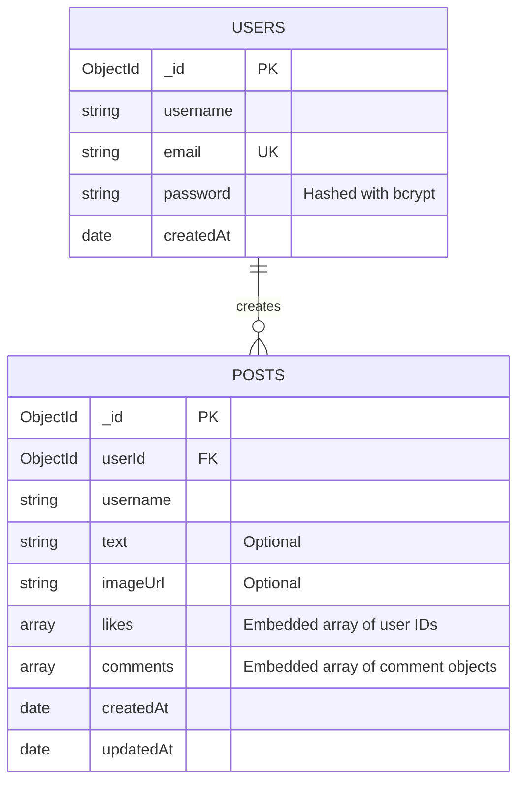

# 🌐 SocialSphere — Mini Social Post Application
> **3W Full-Stack Internship Assignment (Round 1)**  
> Production-ready, full-stack social media feed application built with React.js (Vite), Node.js, Express.js, MongoDB (Mongoose), and Material UI (MUI).

---

## 📌 Overview

**SocialSphere** is a clean, modern social feed application inspired by modern mobile social experiences (such as TaskPlanet). It features complete authentication, a responsive card-based social feed, media uploads (text, images, or both), real-time like toggles with animations, embedded comments with relative timestamps, and smooth pagination.

---

## ✨ Key Features

- **🔐 Robust JWT Authentication:** Secure signup and login with bcrypt password hashing, token verification, and protected client routes.
- **📝 Flexible Post Creation:** Publish text-only, image-only, or text + image posts. Real-time client-side image preview and validation.
- **❤️ Real-time Likes:** Toggle likes with optimistic UI updates, active heart pulse animations, and instant counter changes.
- **💬 Embedded Comments:** Add comments directly to posts with instant feedback and timestamps without full page reloads.
- **📄 Feed Pagination:** Efficient pagination (`GET /api/posts?page=1&limit=10`) with a "Load More" user experience.
- **📱 Fully Responsive UI:** Designed from mobile (375px) up to 4K desktop screens with Material UI (MUI v5) and custom CSS (Strictly NO TailwindCSS).
- **🛡️ Production Security:** HTTP security headers with Helmet, custom CORS policy, input validation, and secure error handling.

---

## 🛠️ Tech Stack

### Frontend
- **Framework:** React.js (v18) with Vite
- **UI & Styling:** Material UI (MUI v5), Emotion, and Clean Custom CSS
- **Routing:** React Router DOM (v6)
- **HTTP Client:** Axios (with request & response interceptors)
- **State Management:** React Context API (`AuthContext`)

### Backend
- **Runtime:** Node.js (v18+)
- **Framework:** Express.js (v4)
- **Database:** MongoDB Atlas with Mongoose ODM (Strictly **2 collections only**)
- **Authentication:** JSON Web Tokens (JWT) & bcryptjs
- **Media Storage:** Multer (with Cloudinary integration and local disk storage fallback)
- **Security:** Helmet, CORS, Morgan logging

---

## 🗄️ Database Design (Strictly 2 Collections)

In compliance with the assignment rules, **only TWO MongoDB collections** are used:



### 1. `users` Collection
Stores registered user credentials.
```json
{
  "_id": "66d81234567890abcdef1234",
  "username": "ayush_gupta",
  "email": "ayush@example.com",
  "password": "$2a$10$hashedPasswordString...",
  "createdAt": "2026-09-04T10:00:00.000Z"
}
```

### 2. `posts` Collection
Stores posts with embedded likes and comments (no separate collections for likes, comments, or reactions).
```json
{
  "_id": "66d89876543210fedcba5678",
  "userId": "66d81234567890abcdef1234",
  "username": "ayush_gupta",
  "text": "Hello world! This is my first post on SocialSphere.",
  "imageUrl": "https://res.cloudinary.com/.../post-123.jpg",
  "likes": [
    "66d81234567890abcdef1234"
  ],
  "comments": [
    {
      "_id": "66d89999543210fedcba9999",
      "userId": "66d81234567890abcdef1234",
      "username": "ayush_gupta",
      "text": "Welcome to the platform!",
      "createdAt": "2026-09-04T10:05:00.000Z"
    }
  ],
  "createdAt": "2026-09-04T10:02:00.000Z",
  "updatedAt": "2026-09-04T10:05:00.000Z"
}
```

---

## 📡 API Endpoints

### 🩺 Health Check
| Method | Endpoint | Access | Description |
|---|---|---|---|
| `GET` | `/api/health` | Public | Check backend health status |

### 🔐 Authentication (`/api/auth`)
| Method | Endpoint | Access | Payload | Description |
|---|---|---|---|---|
| `POST` | `/api/auth/signup` | Public | `{ username, email, password }` | Register new user & issue JWT |
| `POST` | `/api/auth/login` | Public | `{ email, password }` | Authenticate user & issue JWT |
| `GET` | `/api/auth/me` | Private | *Bearer Token* | Get current user profile |

### 📰 Posts & Feed (`/api/posts`)
| Method | Endpoint | Access | Payload / Params | Description |
|---|---|---|---|---|
| `GET` | `/api/posts?page=1&limit=10` | Public / Optional Auth | Query: `page`, `limit` | Get paginated posts with like status |
| `POST` | `/api/posts` | Private | `multipart/form-data`: `text`, `image` | Create new post (text/image/both) |
| `POST` | `/api/posts/:id/like` | Private | URL Param: `:id` | Toggle like / unlike on post |
| `POST` | `/api/posts/:id/comments` | Private | `{ text }` | Add comment to post |

---

## 🚀 Local Setup Guide

### Prerequisites
- Node.js (v18.0 or higher)
- MongoDB installed locally or MongoDB Atlas connection URI

### 1. Clone the Repository
```bash
git clone https://github.com/your-username/mini-social-app.git
cd mini-social-app
```

### 2. Backend Setup
```bash
cd backend
npm install

# Create .env file
cp .env.example .env
```
Fill in your `.env` values:
```env
PORT=5000
MONGODB_URI=mongodb://127.0.0.1:27017/mini-social-app
JWT_SECRET=your_super_secret_jwt_key
CLIENT_URL=http://localhost:5173
```
Start backend server:
```bash
npm run dev
# Server runs at http://localhost:5000
```

### 3. Frontend Setup
```bash
cd ../frontend
npm install

# Create .env file
cp .env.example .env
```
Fill in your `.env` values:
```env
VITE_API_URL=http://localhost:5000/api
```
Start frontend development server:
```bash
npm run dev
# Client runs at http://localhost:5173
```

---

## 🌐 Production Deployment Guide

### 1. Database Deployment (MongoDB Atlas)
1. Log in to [MongoDB Atlas](https://www.mongodb.com/cloud/atlas).
2. Create a free M0 Cluster.
3. Under **Database Access**, create a database user and password.
4. Under **Network Access**, add `0.0.0.0/0` to allow traffic from cloud hosts.
5. Copy your connection URI (e.g. `mongodb+srv://<user>:<password>@cluster0.mongodb.net/mini-social-app?retryWrites=true&w=majority`).

### 2. Backend Deployment (Render)
1. Create a new **Web Service** on [Render](https://render.com).
2. Connect your GitHub repository and set Root Directory to `backend`.
3. Set **Build Command**: `npm install`.
4. Set **Start Command**: `npm start`.
5. Add Environment Variables:
   - `PORT`: `5000`
   - `NODE_ENV`: `production`
   - `MONGODB_URI`: *<Your MongoDB Atlas URI>*
   - `JWT_SECRET`: *<Your random secure secret string>*
   - `CLIENT_URL`: *<Your deployed frontend URL, e.g. https://socialsphere.vercel.app>*
   - *(Optional for Cloudinary)* `CLOUDINARY_CLOUD_NAME`, `CLOUDINARY_API_KEY`, `CLOUDINARY_API_SECRET`.

### 3. Frontend Deployment (Vercel / Netlify)
1. Create a new project on [Vercel](https://vercel.com).
2. Connect your GitHub repository and set Root Directory to `frontend`.
3. Framework Preset: **Vite**.
4. Set Environment Variable:
   - `VITE_API_URL`: `https://your-backend-service.onrender.com/api`
5. Deploy. (The included `vercel.json` ensures client-side routes like `/social` work smoothly on page refreshes).

---

## 📸 Screenshots

*(Add application screenshots here after deployment)*

| Social Feed | Create Post | Mobile View |
|---|---|---|
|  |  |  |

---

## 🔮 Future Improvements

- [ ] Real-time post updates & notifications via WebSockets / Socket.io
- [ ] User Profile pages with bio, avatar customization, and individual post history
- [ ] User follow / unfollow system
- [ ] Rich text editor with hashtag and @mention parsing
- [ ] Media gallery with multiple image uploads and video support

---

## 📄 License

This project is licensed under the MIT License.
