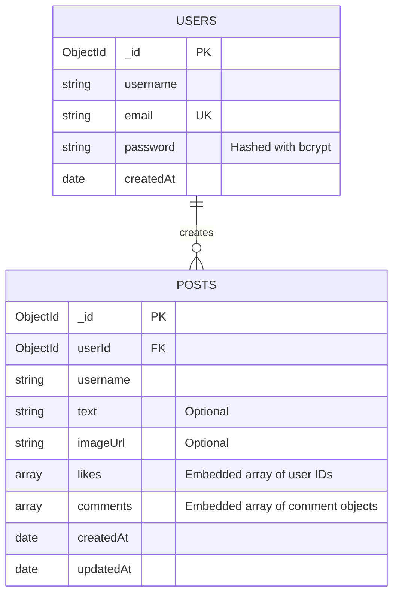

# 🌐 SocialSphere — Mini Social Post Application

> **3W Full-Stack Internship Assignment (Round 1)**
> Production-ready, full-stack social media feed application built with React.js (Vite), Node.js, Express.js, MongoDB (Mongoose), and Material UI (MUI).

---

## 🌐 Live Demo

* **Live Application:** [https://mini-social-application.vercel.app/social](https://mini-social-application.vercel.app/social)
* **Backend API:** [https://mini-social-post-application-7sqd.onrender.com](https://mini-social-post-application-7sqd.onrender.com/)
* **Production API Base:** [https://mini-social-post-application-7sqd.onrender.com/api](https://mini-social-post-application-7sqd.onrender.com/api)

---

## 📌 Overview

**SocialSphere** is a clean, modern social feed application inspired by modern social media experiences. It features complete authentication, a responsive card-based social feed, media uploads (text, images, or both), like toggles, embedded comments with timestamps, and smooth pagination.

---

## ✨ Key Features

* **🔐 JWT Authentication:** Secure signup and login with bcrypt password hashing, token verification, and protected client routes.
* **📝 Flexible Post Creation:** Publish text-only, image-only, or text + image posts with client-side image preview and validation.
* **❤️ Likes:** Toggle likes with instant counter updates and interactive UI feedback.
* **💬 Embedded Comments:** Add comments directly to posts with instant feedback and timestamps without a full page reload.
* **📄 Feed Pagination:** Efficient pagination using `GET /api/posts?page=1&limit=10` with a "Load More" experience.
* **📱 Responsive UI:** Responsive design from mobile screens to large desktop displays using Material UI (MUI v5) and custom CSS.
* **🛡️ Production Security:** HTTP security headers with Helmet, CORS configuration, input validation, and secure error handling.
* **☁️ Cloudinary Media Storage:** Persistent production image storage through Cloudinary integration.

---

## 🛠️ Tech Stack

### Frontend

* **Framework:** React.js (v18) with Vite
* **UI & Styling:** Material UI (MUI v5), Emotion, and custom CSS
* **Routing:** React Router DOM (v6)
* **HTTP Client:** Axios with request and response interceptors
* **State Management:** React Context API (`AuthContext`)

### Backend

* **Runtime:** Node.js (v18+)
* **Framework:** Express.js (v4)
* **Database:** MongoDB Atlas with Mongoose ODM
* **Database Structure:** Exactly 2 collections — `users` and `posts`
* **Authentication:** JSON Web Tokens (JWT) and bcryptjs
* **Media Upload:** Multer with Cloudinary integration and local storage fallback
* **Security:** Helmet, CORS, and Morgan logging

---

## 🗄️ Database Design

The application uses exactly **two MongoDB collections**:

1. `users`
2. `posts`

Likes and comments are embedded inside the `posts` documents. No separate collections are used for likes, comments, or reactions.



### 1. `users` Collection

Stores registered user credentials.

```json
{
  "_id": "66d81234567890abcdef1234",
  "username": "demo_user",
  "email": "demo@example.com",
  "password": "$2a$10$hashedPasswordString...",
  "createdAt": "2026-09-04T10:00:00.000Z"
}
```

### 2. `posts` Collection

Stores posts with embedded likes and comments.

```json
{
  "_id": "66d89876543210fedcba5678",
  "userId": "66d81234567890abcdef1234",
  "username": "demo_user",
  "text": "Hello world! This is my first post on SocialSphere.",
  "imageUrl": "https://res.cloudinary.com/example/image/upload/post-123.jpg",
  "likes": [
    "66d81234567890abcdef1234"
  ],
  "comments": [
    {
      "_id": "66d89999543210fedcba9999",
      "userId": "66d81234567890abcdef1234",
      "username": "demo_user",
      "text": "Welcome to the platform!",
      "createdAt": "2026-09-04T10:05:00.000Z"
    }
  ],
  "createdAt": "2026-09-04T10:02:00.000Z",
  "updatedAt": "2026-09-04T10:05:00.000Z"
}
```

---

## 📡 API Endpoints

### 🩺 Health Check

| Method | Endpoint      | Access | Description                 |
| ------ | ------------- | ------ | --------------------------- |
| `GET`  | `/api/health` | Public | Check backend health status |

### 🔐 Authentication (`/api/auth`)

| Method | Endpoint           | Access  | Payload                         | Description                       |
| ------ | ------------------ | ------- | ------------------------------- | --------------------------------- |
| `POST` | `/api/auth/signup` | Public  | `{ username, email, password }` | Register a new user and issue JWT |
| `POST` | `/api/auth/login`  | Public  | `{ email, password }`           | Authenticate user and issue JWT   |
| `GET`  | `/api/auth/me`     | Private | Bearer Token                    | Get current user profile          |

### 📰 Posts & Feed (`/api/posts`)

| Method | Endpoint                     | Access                 | Payload / Params                       | Description                          |
| ------ | ---------------------------- | ---------------------- | -------------------------------------- | ------------------------------------ |
| `GET`  | `/api/posts?page=1&limit=10` | Public / Optional Auth | Query: `page`, `limit`                 | Get paginated posts with like status |
| `POST` | `/api/posts`                 | Private                | `multipart/form-data`: `text`, `image` | Create a text/image/both post        |
| `POST` | `/api/posts/:id/like`        | Private                | URL Param: `:id`                       | Toggle like/unlike on a post         |
| `POST` | `/api/posts/:id/comments`    | Private                | `{ text }`                             | Add a comment to a post              |

---

## 🚀 Local Setup Guide

### Prerequisites

* Node.js v18.0 or higher
* MongoDB installed locally or a MongoDB Atlas connection URI
* Git

### 1. Clone the Repository

```bash
git clone https://github.com/AyushGupta205/mini-social-post-application.git

cd mini-social-post-application
```

### 2. Backend Setup

```bash
cd backend

npm install

# Create .env file
cp .env.example .env
```

Fill in your `.env` values:

```env
PORT=5000
MONGODB_URI=mongodb://127.0.0.1:27017/mini-social-app
JWT_SECRET=your_super_secret_jwt_key
CLIENT_URL=http://localhost:5173
```

Start the backend server:

```bash
npm run dev
```

Backend runs at:

```text
http://localhost:5000
```

### 3. Frontend Setup

Open a new terminal:

```bash
cd frontend

npm install

# Create .env file
cp .env.example .env
```

Fill in your `.env` values:

```env
VITE_API_URL=http://localhost:5000/api
```

Start the frontend development server:

```bash
npm run dev
```

Frontend runs at:

```text
http://localhost:5173
```

---

## 🌐 Production Deployment Guide

### 1. Database Deployment — MongoDB Atlas

1. Log in to [MongoDB Atlas](https://www.mongodb.com/cloud/atlas).
2. Create a free M0 cluster.
3. Under **Database Access**, create a database user and password.
4. Under **Network Access**, configure access for your deployment environment.
5. Copy your MongoDB connection URI.

Example:

```text
mongodb+srv://<user>:<password>@cluster0.mongodb.net/mini-social-app?retryWrites=true&w=majority
```

### 2. Backend Deployment — Render

1. Create a new **Web Service** on [Render](https://render.com).
2. Connect your GitHub repository.
3. Set the Root Directory to:

```text
backend
```

4. Set the **Build Command**:

```text
npm install
```

5. Set the **Start Command**:

```text
npm start
```

6. Add the following environment variables:

```text
PORT=5000
NODE_ENV=production
MONGODB_URI=<Your MongoDB Atlas URI>
JWT_SECRET=<Your random secure secret string>
CLIENT_URL=https://mini-social-application.vercel.app
```

For Cloudinary image storage, configure:

```text
CLOUDINARY_CLOUD_NAME=<Your Cloudinary cloud name>
CLOUDINARY_API_KEY=<Your Cloudinary API key>
CLOUDINARY_API_SECRET=<Your Cloudinary API secret>
```

### 3. Frontend Deployment — Vercel

1. Create a new project on [Vercel](https://vercel.com).
2. Connect your GitHub repository.
3. Set the Root Directory to:

```text
frontend
```

4. Select **Vite** as the framework preset.
5. Add the following environment variable:

```text
VITE_API_URL=https://mini-social-post-application-7sqd.onrender.com/api
```

6. Deploy the application.

The included `vercel.json` configuration supports client-side routes such as `/social`.

---

## 📸 Screenshots

Screenshots of the deployed application can be added here.

Recommended screenshots:

* Login / Signup
* Social Feed
* Create Post
* Image Post
* Likes and Comments
* Responsive Mobile View

---

## 🔮 Future Improvements

* [ ] Real-time post updates and notifications using WebSockets / Socket.io
* [ ] User profile pages with bio and avatar customization
* [ ] User follow / unfollow system
* [ ] Rich text editor with hashtag and @mention support
* [ ] Media gallery with multiple image uploads and video support
* [ ] Improved notification system
* [ ] Advanced feed filtering and search

---

## 📄 License

This project is licensed under the MIT License.
